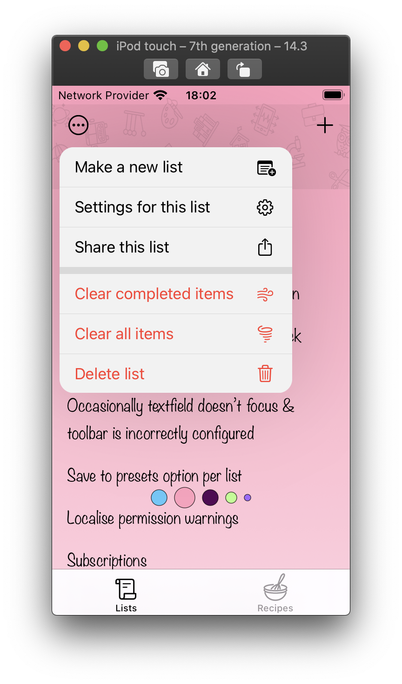
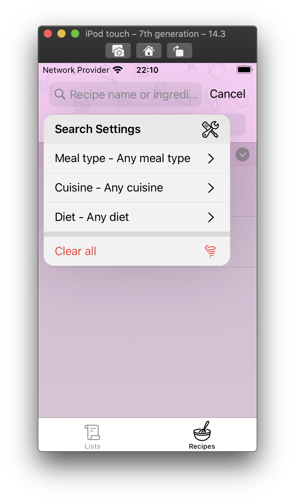
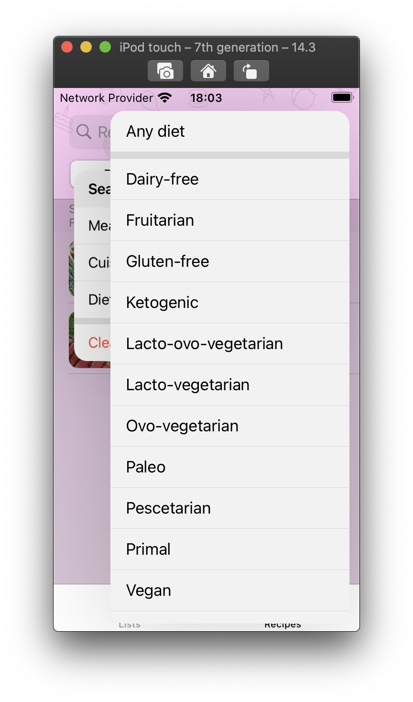

# FWMenu

* A (almost) drop-in replacement for SwiftUI's Menu, but with some customisation options. It also properly prevents touch events from affecting views behind the menu, which is currently an issue with the Apple Menu.
* In addition, it has a "Settings" mode, which allows the hierarchy of menus to be displayed and updated as items are selected (see screen shot) - this is sort of in Beta, & I'm not 100% sure that it's even necessary...
* As a bonus, it can also be presented programmatically.

> Note that the content for the menus is provided by closures, so that it can be dynamically updated.

  

## Installation

### Swift Package Manager

In Xcode:
* File ⭢ Swift Packages ⭢ Add Package Dependency...
* Use the URL https://github.com/franklynw/FWMenu.git


## Example

> **NB:** All examples require `import FWMenu` at the top of the source file


```swift
class MyViewModel: ObservableObject {

    var menuContent: () -> FWMenuSection {
    
        // This creates a menu with a single section containing 2 sub-menu items, & selecting these will present menus (each with 3 action items in this case)
        // It illustrates the use of FWMenuItem.action items where the menu item just performs an action, & FWMenuItem.submenu, where it will present a sub-menu
        
        let menu = { [weak self] () -> FWMenuSection in
            
            guard let self = self, !self.myData.isEmpty else {
                return FWMenuSection([])
            }
            
            let item1 = FWMenuItem.action(name: order.localized) {
                // do something
            }
            let item2 = FWMenuItem.action(name: order.localized) {
                // do something else
            }
            let item3 = FWMenuItem.action(name: order.localized) {
                // do something different
            }
            
            let section1 = FWMenuSection([item1, item2, item3])
            
            let item4 = FWMenuItem.action(name: order.localized) {
                // do something
            }
            let item5 = FWMenuItem.action(name: order.localized) {
                // do something else
            }
            let item6 = FWMenuItem.action(name: order.localized) {
                // do something different
            }
            
            let section2 = FWMenuSection([item4, item5, item6])
            
            let sortMenu = FWMenuItem.submenu(name: "Section 1 stuff", menuItems: section1)
            let filterMenu = FWMenuItem.submenu(name: "Section 2 stuff", menuItems: section2)
            
            return FWMenuSection([sortMenu, filterMenu])
        }
        
        return menu
    }
}

struct MyView: View {
    
    @ObservedObject var viewModel: MyViewModel
    
    var body: some View {
        
        HStack {
            
            Text(viewModel.title)
                .font(.headline)
            
            Spacer()
            
            FWMenu(imageSystemName: "chevron.down", items: viewModel.menuContent)
                .font(Font.title2.weight(.semibold))
                .accentColor(Color(.lightGray))
                .hidePolicyWhenNoItems(.dim(opacity: 0.5))
                .padding(.trailing, 16)
        }
    }
}
```


## Initialisation

There are several initialisers, but they can be broken down into 3 types -

Pass in an array of FWMenuSection items -

```swift
public init(....., sections: @escaping () -> ([FWMenuSection]))
```

Pass in a single FWMenuSection item -

```swift
public init(....., items: @escaping () -> (FWMenuSection))
```

Pass in a single FWMenuItem item -

```swift
public init(....., menu: @escaping () -> FWMenuItem)
```

They are really just there for convenience, and ultimately all do the same thing.

You can initialise with a Label, with a String and an Image (or SystemImage) name, or just the Image (or SystemImage) name - this is how the menu button will be displayed in your view.


## Customisation

There are several customisation options -

### Button accent colour

Sets the accent colour of the menu button.

```swift
FWMenu(imageSystemName: "chevron.down", items: viewModel.menuContent)
    .accentColor(.purple)
```

### Menu background colour

This sets the global background colour for the menu & sub-menus.

```swift
FWMenu(imageSystemName: "chevron.down", items: viewModel.menuContent)
    .contentBackgroundColor(.pink)
```

### Menu text and icon colours

This sets the global text and icon colours for the menu and sub-menus.

```swift
FWMenu(imageSystemName: "chevron.down", items: viewModel.menuContent)
    .contentAccentColor(.red)
```

### Menu Font

This sets the global font for the menu & sub-menus - only in Beta, and only works with system fonts with no modifiers such as weight, etc.

```swift
FWMenu(imageSystemName: "chevron.down", items: viewModel.menuContent)
    .font(.subheadline)
```

### Hide policy if the menu content is empty

Specify how to present the menu button if the menu content is empty - this will update as your data structure is updated.
In this example, the button will dim to 50% opacity.

```swift
FWMenu(imageSystemName: "chevron.down", items: viewModel.menuContent)
    .hidePolicyWhenNoItems(.dim(opacity: 0.5))
```

### Settings Menu

This makes the menu remain on-screen when sub-menus are brought up (it will drop back a little), and will work to any number of menu levels.
Selecting items within the menus which update values which are displayed within the menus will cause the menu content to update,
and if necessary the menu will resize to contain its new content.

```swift
FWMenu(imageSystemName: "chevron.down", items: viewModel.menuContent)
    .settingsMenu
```

### Dismiss on device rotation

Currently, the menu doesn't support device rotation, and there will be bizarre results if your app does support it. Set this to automatically dismiss menus when the device is rotated.
If your app doesn't support device rotation, this isn't required.

```swift
FWMenu(imageSystemName: "chevron.down", items: viewModel.menuContent)
    .dismissOnDeviceRotation
```

### Present Menu programmatically

As a bonus, menus can be presented programmatically. This will simply present the menu from the button as if it had been pressed. If you provide a pressed closure, then pressing the button no longer presents the menu, relying totally on the isPresented binding.

```swift
FWMenu(imageSystemName: "chevron.down", items: viewModel.menuContent)
    .present(isPresented: $viewModel.isMenuPresented) {
        // maybe do something (possibly async) which presents the menu by setting isPresented to true
    }
```


## FWMenuItem

The fundamental building block for the menus is the FWMenuItem, which can be of type .action or .submenu - which are self-explanatory.

There are a couple of things to note -

* The style parameter - this allows you to set the text colour, icon colour, background colour and font for each menu item - these settings will override the global menu style settings.
* The menuTitle parameter (only for submenu items) - allows you to set a title which will be shown at the top of the menu.

The FWMenuSection is just a simple struct for wrapping multiple FWMenuItems to make a section.


## FWMenuPresenter

Should you wish to present a menu programmatically without having to tie it to a button, use the FWMenuPresenter view. It works in an identical way to FWMenu, except that it's not a button, but a view with an isPresented binding.
Setting this to true will show the menu. You can pass in a source rect for the menu to root itself on, or if you omit that, it will centre itself on the screen

This is somewhat in Beta, so there may be issues I'm unaware of.


## MenuPresenter

The class behind everything is the MenuPresenter, which has some static functions which can be accessed directly if required. These are -

* Present from the Navigation Bar, with an x value which is relative to the screen width (0 is fully left, 1 is fully right)

```swift
static func presentFromNavBar(parent: FWMenuPresenting, withRelativeX relativeX: CGFloat)
```

* Present from a source rect

```swift
static func present(parent: FWMenuPresenting, with buttonFrame: CGRect?)
```

* Programmatically dismiss any menu, with an action to invoke on completion (normally this is when the menu item action would be invoked)

```swift
static func dismiss(_ action: Action? = nil)
```

The 'present' functions require that you implement the FWMenuPresenting protocol, which is hidden from you when you use FWMenu or FWMenuPresenter -

### FWMenuPresenting

```swift
var content: () -> ([FWMenuSection]) { get }
var menuType: FWMenuType { get }
var contentBackgroundColor: Color? { get }
var contentAccentColor: Color? { get }
var font: Font? { get }
var hideMenuOnDeviceRotation: Bool { get }
```

There are default implementations of menuType (.standard) and hideMenuOnDeviceRotation (false).


## Issues

Currently, the menu button works properly if it is an image only. There is an issue where the GeometryReader masks the content size of more complex buttons and they don't display properly.
If anyone can fix this, please let me know!

## Dependencies

Requires CGExtensions, which is linked. GitHub page is [here](https://github.com/franklynw/CGExtensions)


## Licence  

`FWMenu` is available under the MIT licence.
